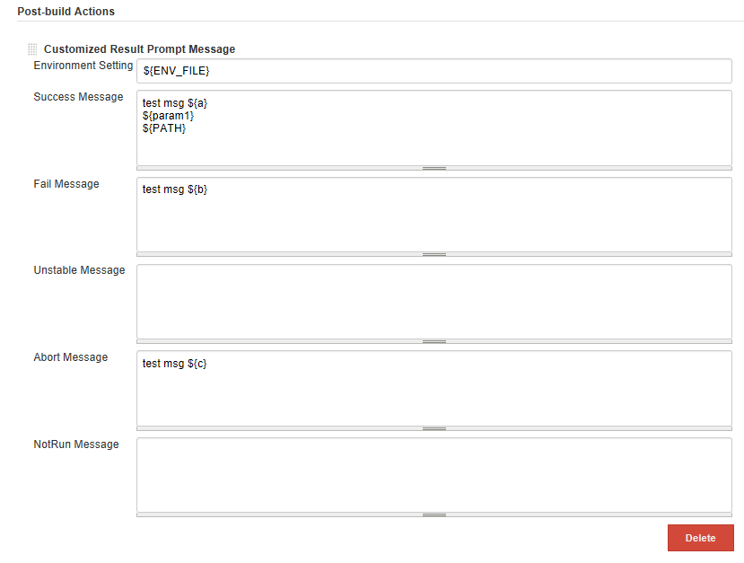
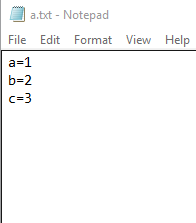
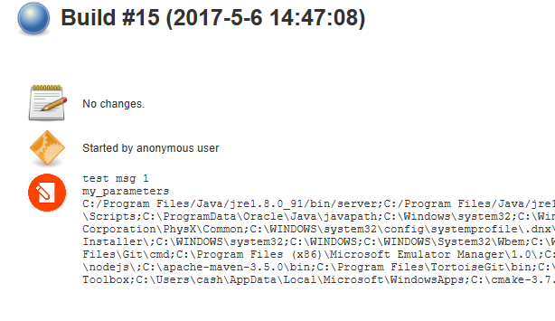

Customized-Build-Message-Plugin
===================================

A plugin for Jenkins CI that customized the prompt message for different build status.

# Screenshots

## Job configuration

**Support the environemnt variable files, input parameters, and default environment variables.**

**Environment variable customizations, both local & remote (slaves) file path are supported.**

**Start to build**

## Result

- build job badge

- build job summary

